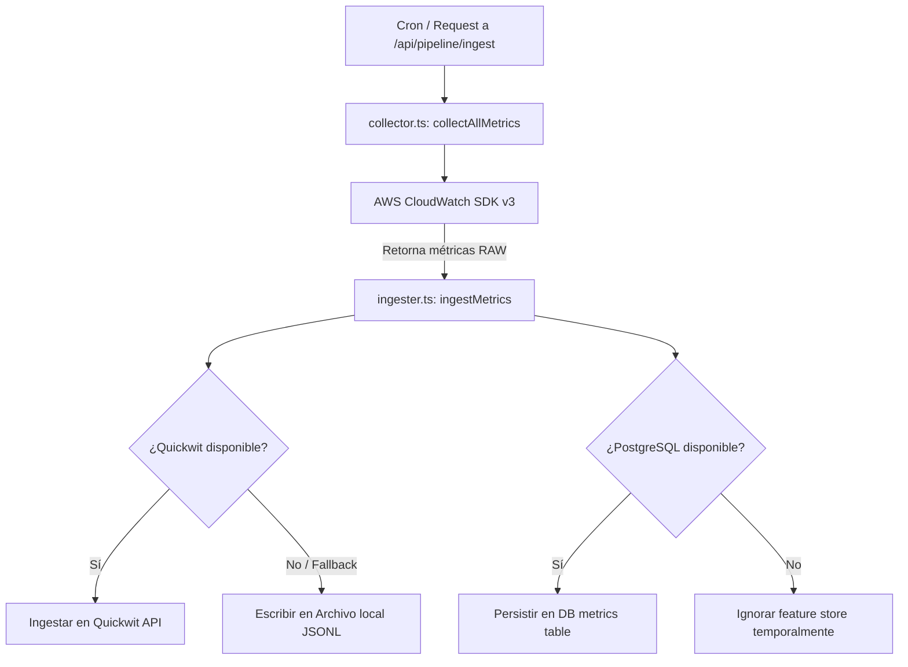
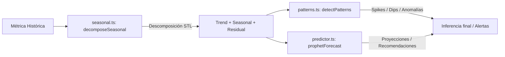
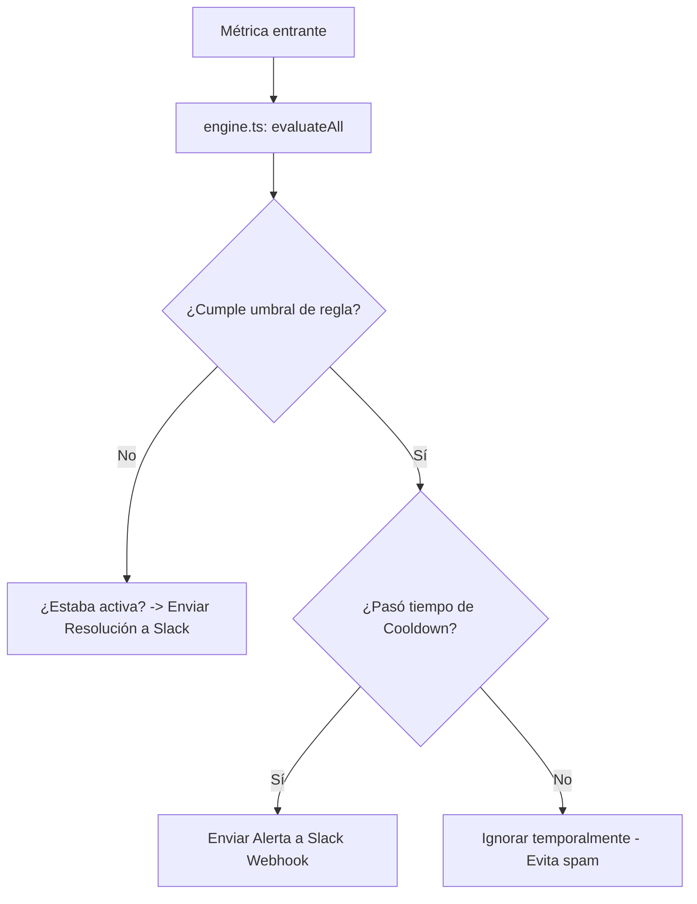

# ObsPlatform — Arquitectura Lógica de Observabilidad

Este documento sirve como referencia técnica sobre el funcionamiento de la **lógica interna** de `ObsPlatform`. Detalla el pipeline de datos, el feature store de ML en PostgreSQL, el motor de análisis matemático/estadístico (IA/ML), y el motor de alertas y notificaciones. Úsalo como guía al agregar nuevas funcionalidades.

---

## 🗺️ Mapa de Componentes Lógicos

El backend de `ObsPlatform` está desacoplado en varios módulos bajo la ruta [src/lib](file:///c:/Users/AMD/Documents/Trabajo/Garage%20Deep%20Analytics%20%28Trabajo%29/Trabajo%20%28Proyectos%29/OBS/obs-platform/src/lib):

```
src/lib/
├── db.ts                   # Cliente PostgreSQL + pgvector (Feature Store)
├── db-init.ts              # Inicializador y ejecutor de migraciones SQL
├── storage.ts              # Encriptación AES-256-GCM y almacenamiento de credenciales AWS
├── slack.ts                # Utilidades de mensajería para Slack
├── external-health.ts      # Monitoreo y checks de salud de servicios externos
│
├── pipeline/               # ── PIPELINE DE DATOS ──
│   ├── collector.ts        # Recolector de CloudWatch (AWS SDK v3)
│   ├── ingester.ts         # Orquestador de ingesta (Quickwit / DB / JSONL)
│   └── quickwit.ts         # API y cliente para motor de búsqueda Quickwit
│
├── ml/                     # ── MOTOR DE INTELIGENCIA ARTIFICIAL / ML ──
│   ├── seasonal.ts         # Descomposición estacional (STL en TypeScript)
│   ├── patterns.ts         # Análisis estadístico y detección de patrones
│   ├── predictor.ts        # Modelos predictivos (Prophet-like) y recomendador
│   ├── correlation.ts      # Análisis de correlación entre métricas
│   └── log-clustering.ts   # Agrupamiento semántico de logs (HDBSCAN-like)
│
└── alerts/                 # ── MOTOR DE ALERTAS ──
    └── engine.ts           # Motor de reglas de alerta, umbrales y cooldowns
```

---

## 📡 1. Pipeline de Ingesta de Datos

El pipeline procesa métricas desde AWS CloudWatch hasta las múltiples capas de almacenamiento.



### Detalle de Implementación:
*   **Recolección ([collector.ts](file:///c:/Users/AMD/Documents/Trabajo/Garage%20Deep%20Analytics%20%28Trabajo%29/Trabajo%20%28Proyectos%29/OBS/obs-platform/src/lib/pipeline/collector.ts)):** Obtiene métricas por bloques utilizando credenciales cifradas y recuperadas de `storage.ts`. Cada servicio se mapea según su namespace (`AWS/ECS`, `AWS/EC2`, `AWS/RDS`, etc.).
*   **Ingesta ([ingester.ts](file:///c:/Users/AMD/Documents/Trabajo/Garage%20Deep%20Analytics%20%28Trabajo%29/Trabajo%20%28Proyectos%29/OBS/obs-platform/src/lib/pipeline/ingester.ts)):** Implementa un esquema de tolerancia a fallos. Si Quickwit está caído o no configurado, la plataforma almacena las métricas localmente en archivos segmentados por día y namespace en `.data/pipeline/<namespace>/YYYY-MM-DD.jsonl`.
*   **Feature Store Integrado:** Al mismo tiempo que ingresa los datos de observabilidad rápida, si PostgreSQL está conectado, inserta los registros en la base de datos relacional para alimentar el entrenamiento e inferencia de los modelos de ML de forma persistente.

---

## 🐘 2. PostgreSQL & ML Feature Store

El archivo [db.ts](file:///c:/Users/AMD/Documents/Trabajo/Garage%20Deep%20Analytics%20%28Trabajo%29/Trabajo%20%28Proyectos%29/OBS/obs-platform/src/lib/db.ts) actúa como el adaptador central de base de datos con las siguientes características lógicas:

1.  **Resiliencia (Graceful Fallback):** Si la base de datos de Docker no está activa (por ejemplo, durante desarrollo local rápido sin ejecutar `docker compose --profile ml up -d`), el cliente captura el error de conexión y todas las funciones de base de datos retornan datos vacíos o estados predeterminados seguros (`[]`, `null`), impidiendo caídas del portal.
2.  **Ejecutor de Migraciones Dinámico ([db-init.ts](file:///c:/Users/AMD/Documents/Trabajo/Garage%20Deep%20Analytics%20%28Trabajo%29/Trabajo%20%28Proyectos%29/OBS/obs-platform/src/lib/db-init.ts)):** Lee secuencialmente y aplica los scripts SQL ubicados en `infra/db/migrations/` al iniciar el servidor de desarrollo (`npm run dev`). Registra cada migración en la tabla `feature_store._migrations` para evitar reaplicaciones.

### Tablas del Schema `feature_store`:
*   `metrics`: Histórico optimizado. Registra timestamps, valores, identificadores y calcula de forma automática atributos lógicos de tiempo como `hour_of_day` (0-23) y `day_of_week` (0-6) para simplificar agrupaciones estacionales en SQL.
*   `anomaly_results`: Guarda el log histórico de detecciones de anomalías (Z-Score y severidades).
*   `predictions`: Registra los forecasts generados junto con los límites inferiores/superiores calculados por el predictor.
*   `model_metadata`: Catálogo de versiones y performance de modelos de machine learning entrenados.
*   `correlation_results`: Mapea correlaciones calculadas entre distintas métricas de la topología para el análisis de causa raíz (RCA).

---

## 🧠 3. Motor de IA/ML (Algoritmia)

Esta capa no depende de frameworks de Python pesados; se ejecuta directamente en TypeScript a través de métodos matemáticos y estadísticos de alta eficiencia:



### A. Descomposición Estacional ([seasonal.ts](file:///c:/Users/AMD/Documents/Trabajo/Garage%20Deep%20Analytics%20%28Trabajo%29/Trabajo%20%28Proyectos%29/OBS/obs-platform/src/lib/ml/seasonal.ts))
Implementa un algoritmo simplificado inspirado en **STL (Seasonal-Trend decomposition using LOESS)**:
1.  **Autodetección de Período (`detectPeriod`):** Calcula la autocorrelación de la serie con múltiples lags (desplazamientos) normalizados por varianza. El desfase con el coeficiente más alto determina el patrón estacional recurrente dominante. Si disminuye de manera puramente monótona, descarta la estacionalidad a favor de una tendencia lineal.
2.  **Descomposición:**
    *   **Trend:** Se extrae mediante una media móvil suavizada.
    *   **Seasonal:** Se calcula promediando los residuos detendenciados en posiciones idénticas del ciclo recurrente.
    *   **Residual (Ruido):** Es el residuo final `original - trend - seasonal`.
3.  **Fuerza de Componentes:** Mide las varianzas de los residuos frente al componente combinado (`trend + residual` o `seasonal + residual`) para entregar scores de 0 a 1 de la robustez de la tendencia y estacionalidad.

### B. Análisis de Patrones (`patterns.ts`)
Identifica estados anómalos o de interés en las series de tiempo mediante:
*   **Z-Score Adaptativo:** Mide cuántas desviaciones estándar se aleja un punto actual del promedio histórico deslizante. Un score superior a 3 (o configurable) es catalogado como spike o dip.
*   **Análisis de Velocidad de Cambio:** Evalúa la derivada discreta de la tendencia para detectar aceleraciones imprevistas de uso.
*   **Clasificación de Eventos:** Detecta patrones clave como `spike`, `dip`, `step_change` y `trend_shift`.

### C. Predicciones / Forecasting ([predictor.ts](file:///c:/Users/AMD/Documents/Trabajo/Garage%20Deep%20Analytics%20%28Trabajo%29/Trabajo%20%28Proyectos%29/OBS/obs-platform/src/lib/ml/predictor.ts))
Genera proyecciones con un modelo basado en principios similares a **Facebook Prophet**:
$$\hat{y}(t) = g(t) + s(t) + e(t)$$
*   $g(t)$ (Tendencia): Ajusta una pendiente lineal por mínimos cuadrados sobre la historia reciente.
*   $s(t)$ (Estacionalidad): Réplica y desplaza cíclicamente el patrón calculado por la descomposición estacional.
*   $e(t)$ (Incertidumbre): Determina límites superiores e inferiores multiplicando la desviación estándar residual (`residualStd`) por el factor de confianza (ej. $1.96$ para el 95%). Aumenta linealmente a medida que se proyecta más lejos en el tiempo.
*   **Recomendador de IA (`generateMLRecommendations`):** Analiza la pendiente de la proyección y la fuerza del ruido para sugerir acciones automatizadas como:
    *   Sugerencia de sobredimensionamiento (Right-sizing) ante subutilización.
    *   Alerta preventiva de saturación si la tendencia proyectada supera el 80% en los próximos periodos.
    *   Ajuste de escalado por ciclos (Weekday vs. Weekend) si se detecta alta estacionalidad.

---

## 🔔 4. Motor de Alertas e Integración Slack

El motor de alertas une las lecturas métricas en caliente con la lógica de notificación en canales remotos:



### Gestión de Reglas ([engine.ts](file:///c:/Users/AMD/Documents/Trabajo/Garage%20Deep%20Analytics%20%28Trabajo%29/Trabajo%20%28Proyectos%29/OBS/obs-platform/src/lib/alerts/engine.ts)):
*   **Filtros de Reglas:** Mapea reglas por campo `metric` y `namespace`.
*   **Evaluación:** Compara valores en base a operadores lógicos (`gt`, `lt`, `gte`, `lte`).
*   **Cooldown:** Para evitar el bombardeo repetitivo de alertas (alert fatigue), el sistema evalúa la propiedad `lastFiredAt` de la regla. Solo vuelve a despachar un webhook a Slack si la diferencia temporal supera los minutos definidos por `cooldownMinutes`.
*   **Resolución Automática:** Cuando una métrica anteriormente alertada vuelve a rangos normales, el sistema detecta que la alerta está activa pero ya no gatillada, despachando de forma automática un mensaje Slack verde de `Resolved` y limpiando el estado.

---

## 🛠️ Guía para Agregar Nuevas Funcionalidades

### A. Cómo añadir un nuevo namespace de AWS a monitorear
Si deseas soportar un nuevo namespace como `AWS/DynamoDB`:
1.  **Registrar Namespace:** Agrega el namespace a la constante `DEFAULT_NAMESPACES` en [src/lib/pipeline/collector.ts](file:///c:/Users/AMD/Documents/Trabajo/Garage%20Deep%20Analytics%20%28Trabajo%29/Trabajo%20%28Proyectos%29/OBS/obs-platform/src/lib/pipeline/collector.ts).
2.  **Métricas Clave:** Define qué métricas clave descargar de CloudWatch en la variable `metricsByNamespace` (ej: `ReadThrottleEvents`, `WriteThrottleEvents`).
3.  **Procesamiento:** El ingester y la base de datos están automatizados; procesarán este namespace automáticamente.

### B. Cómo añadir un nuevo modelo de detección de anomalías
Si deseas introducir un nuevo algoritmo (ej: basado en media móvil exponencial EWMA):
1.  **Implementar Algoritmo:** Crea la lógica del algoritmo en una nueva función o módulo dentro de `src/lib/ml/`.
2.  **API Route:** Integra la invocación en la API `/api/ml/anomalies`.
3.  **Tests:** Añade un nuevo test suite en `src/lib/__tests__/` usando Vitest para asegurar el correcto cálculo matemático del algoritmo.

### C. Cómo extender el motor de alertas a un canal adicional (ej: PagerDuty o Email)
1.  **Modificar Modelo:** Modifica la interfaz `AlertRule` en [engine.ts](file:///c:/Users/AMD/Documents/Trabajo/Garage%20Deep%20Analytics%20%28Trabajo%29/Trabajo%20%28Proyectos%29/OBS/obs-platform/src/lib/alerts/engine.ts) para soportar el nuevo canal en el array `channels`.
2.  **Servicio de Envío:** Desarrolla el cliente de integración en `src/lib/` (ej. `pagerduty.ts`).
3.  **Enlazar Evento:** Llama a este nuevo cliente dentro de la función `evaluateAll` en `engine.ts` bajo la validación:
    ```typescript
    if (rule.channels.includes("pagerduty")) {
       // dispatch a PagerDuty
    }
    ```

---

## 🧪 Prácticas de Testing y Validaciones

Siempre que realices cambios lógicos en las funciones matemáticas, de persistencia o alertas, debes ejecutar y expandir la suite de tests unitarios:

```bash
# Ejecutar todas las pruebas unitarias
npm test

# Ejecutar con reporte de cobertura para asegurar no dejar ramas de lógica sin testear
npm run test:coverage
```

### Reglas Críticas al Programar Logic-code:
1.  **Tolerancia de Dependencias:** El backend puede ejecutarse sin Docker. Cualquier módulo que requiera PostgreSQL, NATS o Quickwit **debe** envolverse en un bloque `try-catch` y proveer un fallback lógico (ej: almacenar localmente en disco o devolver datos de mock/vacíos).
2.  **Sin Variables Globales de Estado con Hilos Compartidos:** Las API routes de Next.js corren en entornos serverless y server-side dinámicos. Evita variables globales in-memory para persistencia crítica; en su lugar, utiliza el Feature Store de PostgreSQL o la capa de archivos locales `.data/` para almacenar estados que deban sobrevivir al ciclo de vida de una petición HTTP.
